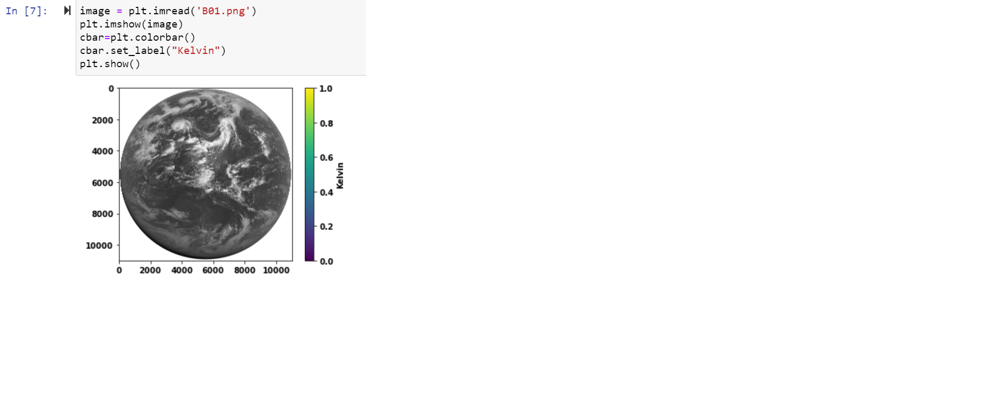
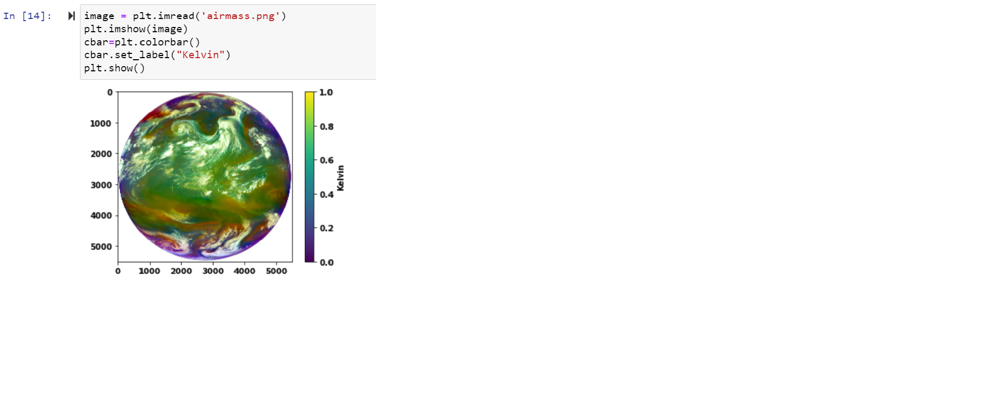

# Python_JAXA_Himawari8_Imagery_Downloader
Python script to ftp download of himawari8 real-time full disk satellite image files from JAXA server for the specified date range(Himawari standard data will be provided only for the latest 30 days).     

<h2>Pre-requisites:</h2> 
<b>User Registration </b> 
<ol>
  Make an User Account request for the data use of JAXA’s p-Tree system:  
          a. Apply for a user account by clicking the ’user registration’ button on top of the website https://www.eorc.jaxa.jp/ptree/index_j.html.   
          b. Enter the user information according the procedure described. Application acceptance email will be sent from the P-Tree secretariat.  
          c. Download the python package from my repository.  git clone https://github.com/gSasikala/Python_JAXA_Himawari8_Imagery_Downloader.git  
          d. Open the python script 'ftp_himawari8_hsd.py' in your preferred editor. 
  </li></ol>
<b>Software needed</b> 
<ol>
  <li> Install Anaconda framework(Opensource) from website  https://www.anaconda.com/products/individual to your local machine.</li>
  <li> Install Python(version >= 3.7) from website https://www.python.org/downloads/</li>  
  <li> After successfully installing Python, Create virtual or conda environment and install the following python dependencies as listed in requirements.txt   
    </li>
</ol>
<b>Python Dependencies:</b> 
ftp_himawari8_hsd.py depends on the python packages as listed in requirements.txt file of this repository.    
<!-- How to do: Open python terminal and key in as follows  
      pip install argparse==1.4.0   Press Enter Key   
      This will install the package to your work environment. Do the same for remaining packages. 
     <!-- pip install dateparser==1.0.0   
      pip install DateTime==4.3   
      pip install wget==3.2       
      pip install bz2file==0.98  
      pip install python-dateutil==2.8.1  
      pip install pathlib==1.0.1   
      pip install regex==2020.11.13   
      pip install futures3==1.0.0  
      pip install pandas==1.3.3  
      pip install satpy==0.25.1  
      pip install cartopy==0.17.0  
      pip install matplotlib==3.3.4  
      pip install pyproj==2.6.1   -->
    
<h2>Usage</h2>  
<h3>Downloading Satellite Imagery from JAXA server</h3>  
Execute python script ftp_himawari8_hsd.py. Input start date and end date, download file path, JAXA username and password.  
<strong><i> python ftp_himawari8_hsd.py </i></strong>  
ex: 
<b> > python ftp_himawari8_hsd.py </b>  
 usage 1: download for given range of dates  
    Enter start datetime yyyy/mm/dd hh:mm: 2021/07/25  
    Enter end datetime yyyy/mm/dd hh:mm : 2021/07/25  
    Output file timestamps are every 10-minute timestamps from "2021/07/25 00:00" to "2021/07/25 23:50".  
 usage 2: download for given time range of current date  
    Enter start datetime yyyy/mm/dd hh:mm: 01:00  
    Enter end datetime yyyy/mm/dd hh:mm : 01:20  
    Output file timestamps are current day's "01:00", "01:10" and "01:20".
 usage 3: download for given range of timestamps  
    Enter start datetime yyyy/mm/dd hh:mm: 2021/7/25 00:00  
    Enter end datetime yyyy/mm/dd hh:mm : 2021/7/25 23:50  
    Output file timestamps are every 10-minute timestamps from "2021/07/25 00:00" to "2021/07/25 23:50".  
    
    Enter download file path : D:\ftp_test  
    
    Enter your username and password: test_123

This will download the AHI Himawari8 full-disk satellite image as *.dat file format zipped. 
<i> AHI Himawari8 Full Disk image for Band 1 </i> 

<h3> Open, Process, Crop, Save Satellite Imagery and generate Composites </h3>  
Refer to 'Processing_Satellite_Imagery.ipynb' file of this repository for how to open the downloaded files and make use of it. 
Download atleast 10 minutes (2:00 to 2:10pm) data of a date to work on this processing.  
<h3>Composites</h3>
To generate Satpy Composites needs all bands B01-B16 for atleast 10 minutes timeframe of a date.
 
   
  

